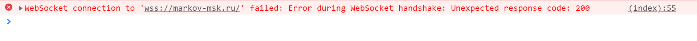

# Сборка на https (wss)

На стороне клиента на HTTPS все отлично отрабатывает, но выдает данную ошибку, т.к. express не может корректно обработать запрос.



## Project setup
```
npm i
```

### Compiles for development
```
npm run serve
```
