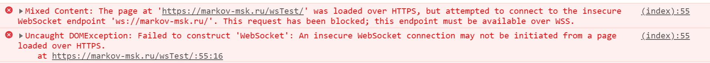

# Сборка на http (WS)

Работает только на HTTP + WS


Если запустить на домене с HTTPS, выдаст логичную ошибку:



## Project setup
```
npm i
```

### Compiles and hot-reloads for development
```
npm run serve
```
